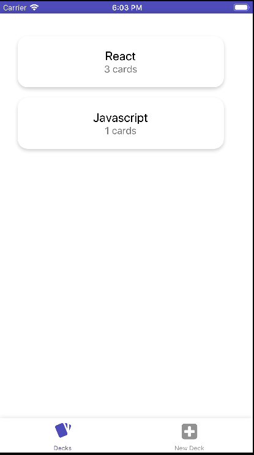
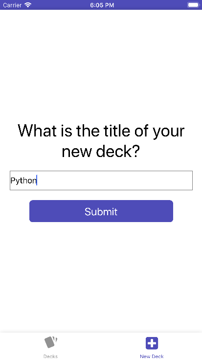
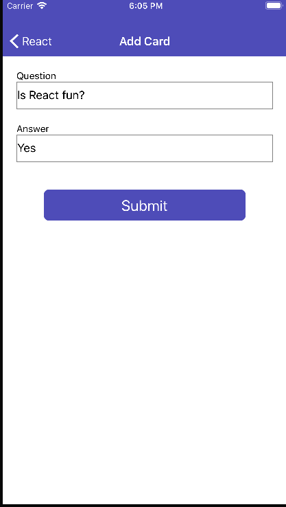
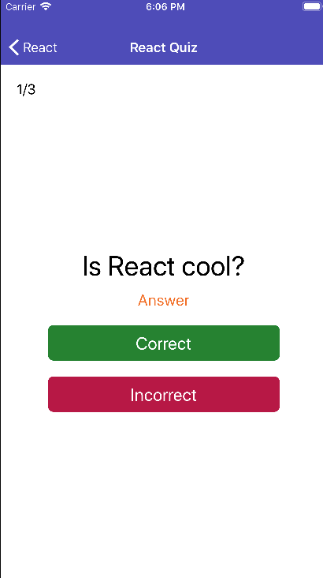
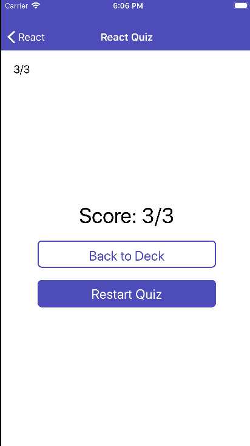

## Mobile Flashcards Project

This project is a mobile app for making flash cards to test themselves. Users have the ability to create new decks of cards for a subject they are studying. The user can then create a number of questions for that deck. Finally the user has the ability to take a quiz for a specific deck. The user can view the question/answer and select whether the got the question correct or incorrect. Once they have answered all questions they are shown a score of how they did. If a user hasn't completed a quiz in the current day they will receive a notification to complete one.

This app runs on both the Android and iOS mobile operating systems.

To install the app perform:
```npm install```

To run the app perform:
```yarn start```

Once started to start the Android emulator type `a`

Once started to start the iOS emulator type `i`

Here are some screenshots from the app:






